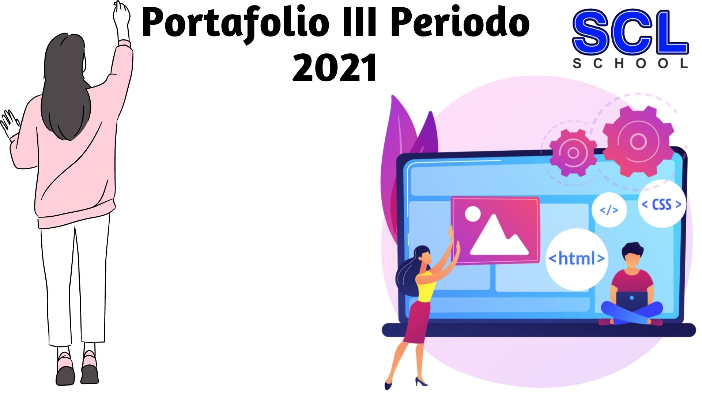
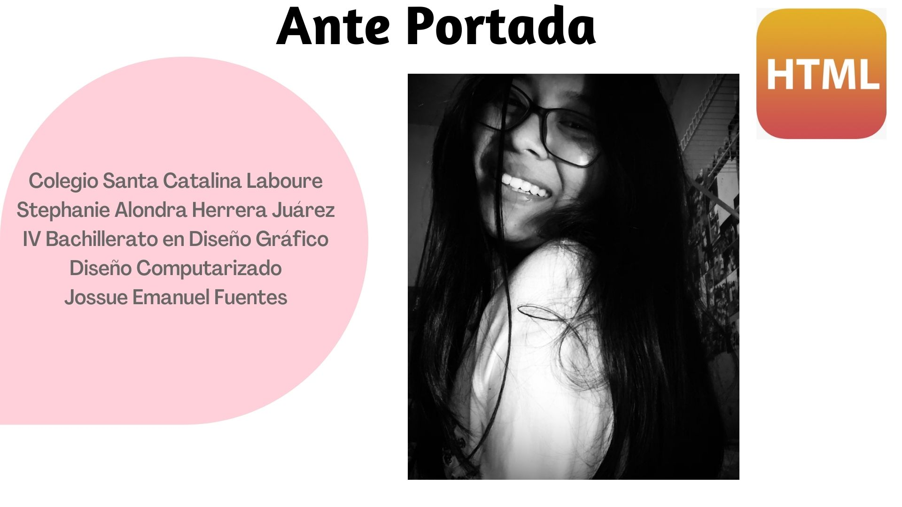
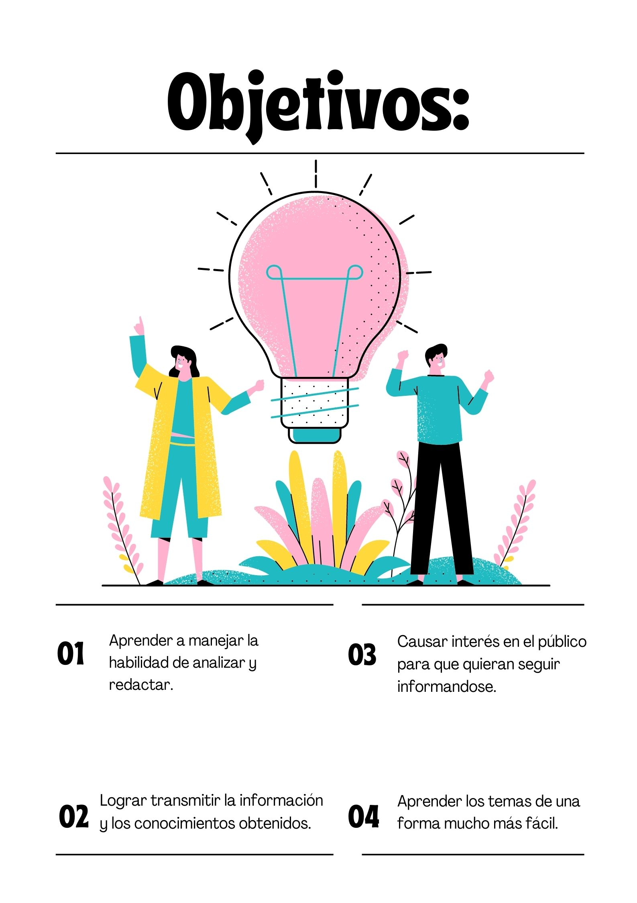

# Glosario

<h1>Índice</h1>
<ol>
<li>Home Page</li>
<li>Header</li>
<li>Tipos de etiquetas</li>
<li>Estructura de etiquetas</li>
<li>Listas de etiquetas dirigidas al texto</li>
   <li>Títulos</li>
   <li>Párrafos</li>
<li>Listas de etiquetas dirigidas a objetos</li>
   <li>Estructuras</li>
   <li>Imágenes</li>
<li>Otras etiqeutas para diseñar tu página web</li>
  <li>Listas ordenadas</li>
  <li>Listas desordenadas</li>
  <li>Para crear tablas</li>
<li>Tabla de Propiedades Genarales</li>
<li>Tabla de propiedades CSS aprendidas en el segundo periodo</li>
<li>¿Cómo se conecta un css en HTML?</li>
</ol>

